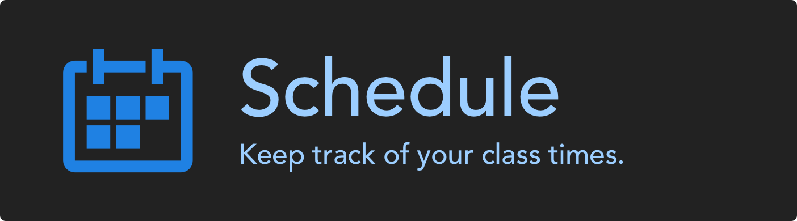

 
# Schedule App
A quick way to see the school schedule in the beginning of the school year.
This is only around 8 lines of code, but it's a quick way to add in your own class list and school period times to see both at a quick glance. It switches to the schedule of the correct day automatically.

A much more advanced app that tells you the time remaining in the period, your next class, any special schedules, etc. is planned and in the works.
